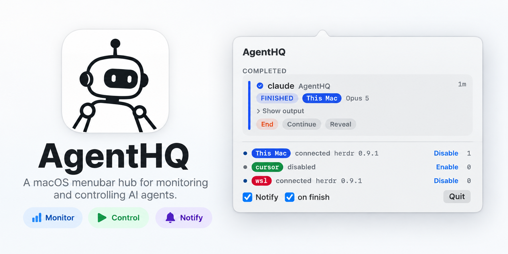

# AgentHQ



A native macOS menu-bar app for seeing AI coding agents running across every
machine you work on — this Mac, remote Linux/macOS hosts over SSH, and Windows
machines through WSL — in one place.

It answers three questions at a glance:

1. What agents are running?
2. Which ones need me?
3. What is the next action?

AgentHQ is **attention-first**, not a process list. Agents that are blocked,
waiting for approval, failed, rate-limited, or finished come first; working
agents stay visible but secondary.

Status: **working.** It builds as a menu-bar app, imports machines from
herdr's own registry, tunnels to them over SSH, classifies what each agent is
waiting on, and can answer, decline, reply, nudge, reveal or end one from the
panel. It notifies when an agent needs you, when a run finishes — with what
the run actually said — and when a machine stops answering. Machines that go
down recover on their own. Verified end to end against a local herdr and a
WSL host over Tailscale.

`ssh -L` unix-socket forwarding is verified against a WSL2 host over
Tailscale: usable 0.3s after launch, two concurrent connections served
independently, a 200KB round trip in ~98ms.

## How it works

```
AgentHQ.app
│
├── Local machine
│   └── herdr
│
├── Remote macOS / Linux
│   └── SSH → herdr
│
└── Windows machine
    └── SSH → WSL → herdr
```

AgentHQ uses [herdr](https://herdr.dev) as its runtime layer for agent
discovery, state, and pane output. A remote machine is reached by forwarding
its herdr socket with `ssh -N -L <local.sock>:<remote.sock>`, which means a
remote machine reduces to *a different socket path on this Mac*. Nothing above
the transport layer knows the difference.

WSL is treated as an ordinary Linux host running its own sshd — not as
something reached through Windows.

## Architecture

```
AgentHQKit        domain model, zero I/O
AgentHQTransport  LocalSocket | SSHTunnel — both resolve to a local socket path
AgentHQHerdr      herdr wire protocol; knows one path, nothing about fleets
AgentHQFleet      MachineSession × N, and the snapshot assembled from them
AgentHQApp        SwiftUI menu bar
```

The layering is enforced by the package graph, and the direction of ignorance
is the point: `AgentHQHerdr` cannot accidentally learn about machines, so all
multi-machine complexity stays in `AgentHQFleet`.

Two invariants worth knowing before reading the code:

- **A pane id is only meaningful inside one machine.** herdr numbers panes per
  host and has no idea other hosts exist, so `AgentRef` (machine + pane) is the
  key for anything fleet-wide. `AgentID` alone goes back on the wire verbatim.
- **Machine reachability is a separate axis from agent state.** When SSH drops,
  the agents on the far side are fine — AgentHQ just stopped seeing them.
  Collapsing that into a per-agent "crashed" turns one dropped tunnel into
  twelve false alarms.

## Requirements

- macOS 14+
- Swift 6 toolchain (Xcode 16+)
- [herdr](https://herdr.dev) on every machine you want to watch
  (verified against herdr 0.9.1, wire protocol 22)
- OpenSSH 6.7+ for remote machines (unix-socket forwarding)

### Machines

This Mac needs nothing beyond a running herdr — AgentHQ finds its socket and
lists it as "This Mac".

Every other machine has to be registered with herdr **on this Mac** first:

```sh
herdr machine add --label wsl <ssh-target>
```

AgentHQ imports them from herdr's own registry, so there is no second list to
keep in sync: add a machine in herdr and it appears in the panel, already
carrying herdr's id for it. That registry is internal herdr state rather than
a published API, so it is treated as an import source — if it is missing or
its schema changes, you get no imported machines rather than an error.

The ssh target is resolved by ssh itself, so key selection, jump hosts and
ports belong in `~/.ssh/config` under that alias — including for WSL, which
is an ordinary entry here.

### Terminals

Any terminal. Watching agents, notifications, and every action except Reveal
go through herdr's socket and never touch the terminal herdr is running in.

**Reveal is the exception, and today it is Ghostty-only** — the AppleScript
addresses `com.mitchellh.ghostty` by bundle id. Under another terminal the
herdr half of a reveal still happens (the pane is focused in herdr's own
server) but AgentHQ cannot raise the window, so the row reports a Ghostty
error instead of a confirmation. Nothing else is affected.

With Ghostty 1.3+: on this Mac it focuses the surface already running herdr;
for a remote machine it opens or reuses a window attached to that machine.
macOS asks permission to let AgentHQ control Ghostty on first use.

## Build

```sh
swift build
swift test
swift run AgentHQApp   # development
./build-app.sh         # AgentHQ.app, the installed menu-bar bundle
```

`swift build` does not update `AgentHQ.app` — the bundle carries its own
release build, and only `build-app.sh` refreshes it.

## Not in scope

Usage/cost dashboard, MCP server, detecting agents outside herdr, a terminal
emulator.

## License

GPL-3.0 — see [LICENSE](LICENSE).

Parts of AgentHQ are ported from
[Shepherd / herdr-manager](https://github.com/sxp4931/herdr-manager) (MIT,
© Shyam Pandya). See [NOTICE](NOTICE) for what was ported and the MIT terms
that continue to apply to it.
